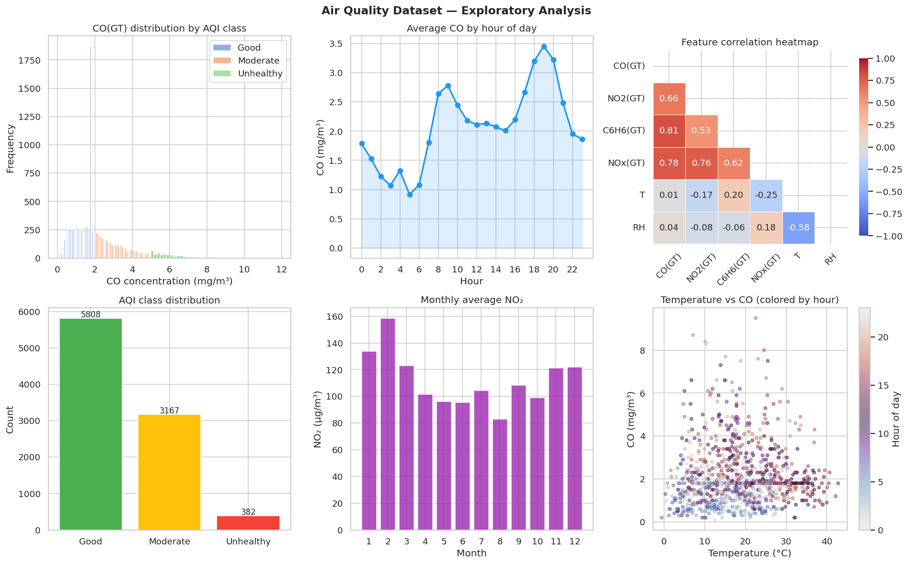
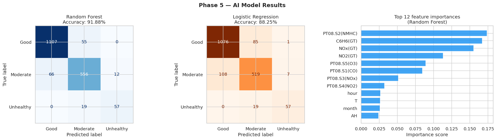
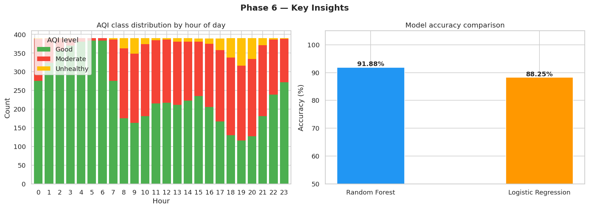

# 🌫️ Air Quality Classification — IoT + AI

Classifying urban air quality into **Good / Moderate / Unhealthy** levels using real multi-sensor IoT data from a city air-monitoring station, with full data analysis, feature engineering, and machine learning model comparison.

**Domain:** Smart City — Air Pollution Monitoring
**Task:** Multi-class classification
**Best model:** Random Forest — **91.88% accuracy**

---

## 📌 Project Overview

IoT gas sensors deployed in cities produce continuous streams of noisy, incomplete readings. This project shows how to turn that raw sensor data into an actionable air-quality signal:

1. Load and clean real IoT sensor data (including sensor error codes)
2. Explore pollution patterns over time (hourly, weekly, monthly)
3. Engineer time-based features from timestamps
4. Train and compare classification models
5. Simulate real-time prediction from a new sensor reading

---

## 📂 Dataset

**[UCI Air Quality Dataset](https://archive.ics.uci.edu/dataset/360/air+quality)**

- **Source:** A gas multisensor device deployed at road level in an Italian city
- **Period:** March 2004 – April 2005 (hourly averages)
- **Size:** 9,357 records × 15 columns
- **Sensors:** 5 metal-oxide chemical sensors (`PT08.S1`–`PT08.S5`) plus reference analyzer readings for CO, NMHC, C6H6 (benzene), NOx, NO2, and weather data (temperature, relative & absolute humidity)
- **Missing values:** Encoded as `-200` by the sensors

> Download `AirQualityUCI.csv` from the link above and place it in the same folder as the notebook.

---

## 🔄 Project Pipeline

### Phase 1 — Data Loading
- Parsed the semicolon-separated file with European decimal commas
- Removed empty trailing rows and columns

### Phase 2 — Preprocessing
- Replaced sensor error code `-200` with `NaN`
- Filled missing values with the **column median** (robust to outliers)
- Combined `Date` and `Time` into a single `datetime` column
- Extracted time features: `hour`, `day_of_week`, `month`, `is_weekend`
- Created the target label `AQI_label` from CO concentration (EPA-inspired thresholds):

| AQI Level | CO(GT) (mg/m³) | Samples |
|-----------|----------------|---------|
| Good      | < 2.0          | 5,808 (62%) |
| Moderate  | 2.0 – 5.0      | 3,167 (34%) |
| Unhealthy | ≥ 5.0          | 382 (4%) |

### Phase 3 — Exploratory Analysis & Visualization
Six-panel analysis: CO distribution per class, hourly CO trend, correlation heatmap, class balance, monthly NO₂, and temperature vs. CO.



### Phase 4 — Feature Engineering
- **15 features:** 11 sensor/weather readings + 4 time features
- **Dropped `NMHC(GT)`** — ~90% of its values were missing
- **Dropped `CO(GT)`** from features since it defines the target (prevents label leakage)
- Label-encoded the target
- Stratified **80/20 train-test split** (7,485 / 1,872)
- **StandardScaler** applied (required for Logistic Regression)

### Phase 5 — Model Development
| Model | Why it was chosen |
|-------|-------------------|
| **Random Forest** (main) | Handles non-linear relationships between sensors, robust to noisy IoT data, gives feature importance |
| **Logistic Regression** (baseline) | Simple linear model to test whether the problem needs a non-linear approach |



### Phase 6 — Insights & Real-World Simulation


---

## 📊 Results

| Model | Accuracy | Macro F1 | Weighted F1 |
|-------|----------|----------|-------------|
| **Random Forest** | **91.88%** | **0.87** | **0.92** |
| Logistic Regression | 88.25% | 0.85 | 0.88 |

**Random Forest — per-class performance**

| Class | Precision | Recall | F1-score |
|-------|-----------|--------|----------|
| Good | 0.94 | 0.95 | 0.95 |
| Moderate | 0.88 | 0.88 | 0.88 |
| Unhealthy | 0.83 | 0.75 | 0.79 |

The ~3.6% accuracy gap shows that the decision boundary between AQI levels is **non-linear**, which justifies using Random Forest.

---

## 💡 Key Findings

1. **Traffic drives pollution:** CO peaks during the morning (~8 AM) and evening (~7 PM) rush hours and is lowest around 4–5 AM.
2. **Pollutants move together:** CO correlates strongly with benzene (C6H6) and NOx — all traffic-related emissions.
3. **Seasonal effect:** NO₂ is highest in winter months and lowest in late summer.
4. **Weekdays are worse:** Weekdays show higher CO and NOx levels than weekends.
5. **Top predictors:** The `PT08.S2(NMHC)` sensor and benzene concentration are the most important features, while time features contribute less than chemical sensors.

---

## 🌐 Real-World Application

The trained model can classify a live reading from an IoT sensor node:

```python
sample_reading = {
    "PT08.S1(CO)": 1046, "C6H6(GT)": 2.6, "PT08.S2(NMHC)": 955,
    "NOx(GT)": 103, "PT08.S3(NOx)": 1174, "NO2(GT)": 92,
    "PT08.S4(NO2)": 1447, "PT08.S5(O3)": 711,
    "T": 13.6, "RH": 47.7, "AH": 0.7578,
    "hour": 8, "day_of_week": 1, "month": 3, "is_weekend": 0
}
# Predicted AQI: Good  (Good 77.4% | Moderate 22.6% | Unhealthy 0.0%)
```

In a deployed system, an **Unhealthy** prediction could trigger public health alerts, traffic rerouting, or notifications to residents.

---

## ⚠️ Limitations & Future Work

- **Class imbalance:** Only 4% of samples are Unhealthy, which lowers its recall (0.75). Future work: class weights, SMOTE, or threshold tuning.
- **Median imputation:** Rows with missing CO were filled with the median, which places them in the "Good" class. Dropping or model-based imputation could give cleaner labels.
- **Single-pollutant label:** AQI is derived from CO only; a real AQI combines several pollutants.
- **Future models:** XGBoost/LightGBM, hyperparameter tuning with cross-validation, and time-series models (LSTM) for forecasting future AQI.

---

## 🗂️ Project Structure

```
Air-Quality-IoT-Classification/
├── air_quality_annotated.ipynb   # Full notebook (all phases + explanations)
├── requirements.txt              # Python dependencies
|── AirQualityUCI.csv             # Dataset
├── README.md
└── images/
    ├── phase3_visualization.png
    ├── phase5_model_results.png
    └── phase6_insights.png
```

---

## 🚀 How to Run

```bash
# 1. Clone the repository
git clone https://github.com/<your-username>/<your-ml-repo>.git
cd <your-ml-repo>/Air-Quality-IoT-Classification

# 2. Install dependencies
pip install -r requirements.txt

# 3. Download AirQualityUCI.csv from UCI and place it in this folder

# 4. Run the notebook
jupyter notebook air_quality_annotated.ipynb
```

Or open the notebook directly in **Google Colab** and upload `AirQualityUCI.csv` to the session.

---

## 🛠️ Tech Stack

Python · pandas · NumPy · scikit-learn · Matplotlib · Seaborn · Jupyter / Google Colab

---

## 👤 Author

**Ahmed Farouk** — AI Engineer
